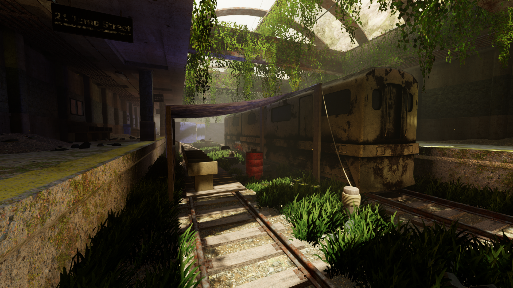
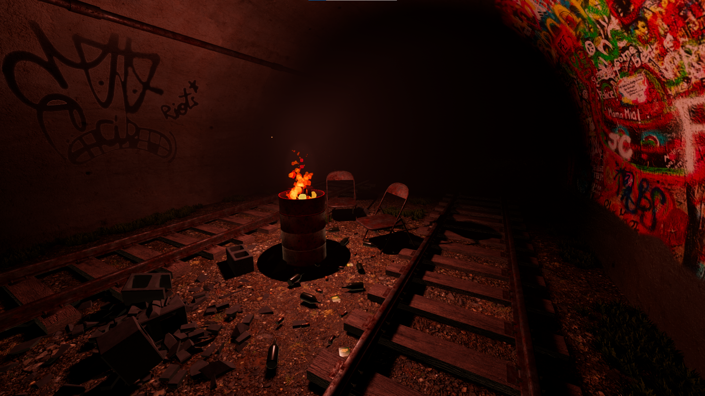
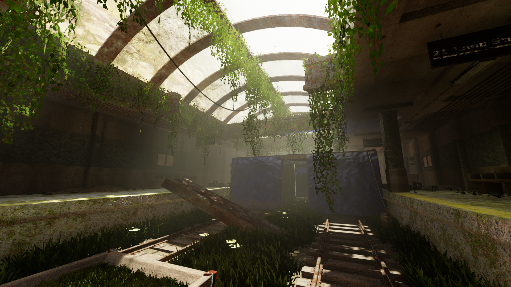
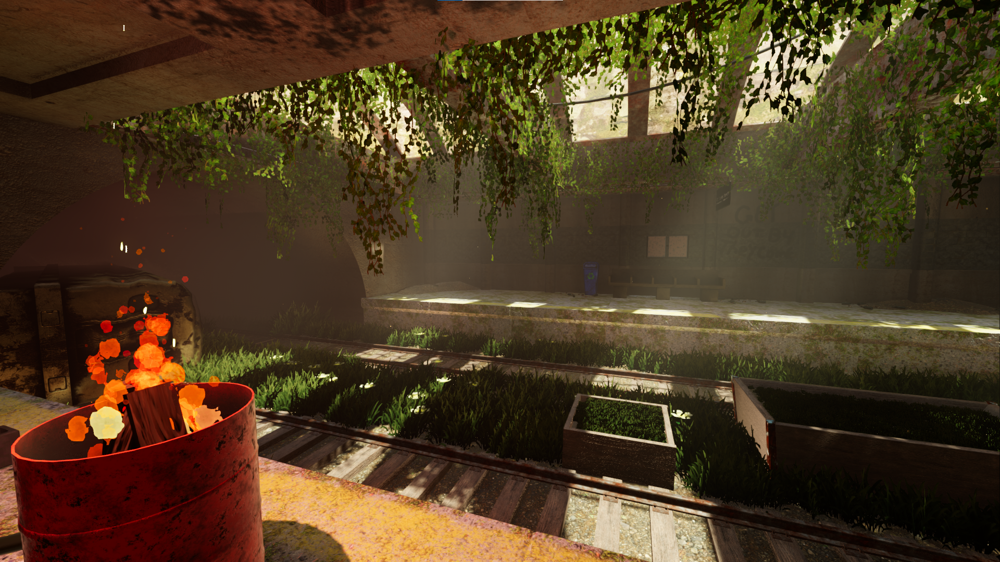

# Godot-4-Overgrown-Subway
Godot 4 Demo Scene of an overgrown subway inhabited by squatters.

## How to use:
1. This project uses .blend files for scenes. This means you need to have blend file support enabled before you open the project. [Here's how.](https://docs.godotengine.org/en/stable/tutorials/assets_pipeline/importing_scenes.html)
2. Download the zip/clone the repo. If you download the zip, extract the contents where you want the project to be.
3. Open the project.godot file with Godot 4.0
4. Run the default scene. (subway.tscn)
5. WASD for movement, shift to sprint, space to jump, F for flashlight, ESC for menu.
6. Gamepad is also supported. Left stick to move, L3 to sprint, A/X to jump, right stick to look, pause to open menu, UP on D-Pad for Flashlight.

## Features:
1. Uses LightMapGI and ReflectionProbes.
2. Uses Volumetric Fog
3. Buttons and sliders in game menu for enabling SSIL, SSAO, Glow. Also has input sensitivity controls and volume controls.
4. Uses Decal nodes introduced with Godot 4.
5. Uses AudioStreamPlayer3D nodes for sound effects.
6. Uses Blend File workflow, Blend files included.

## Included plugins and assets:
[SimpleGrass](https://github.com/IcterusGames/SimpleGrassTextured) by IcterusGames (MIT)

Ivy Assets by Perfoon from the [Abandoned Space Ship Demo](https://github.com/perfoon/Abandoned-Spaceship-Godot-Demo) (Big thanks for the inspiration, by the way!) (Non-Commercial CC)

All sounds from [Chosic](https://www.chosic.com/)  (CC0 1.0)

Several ground, concrete, metal etc textures from [AmbientCG](https://ambientcg.com/) (CC0 1.0)

All assets not covered above are available under MIT.

